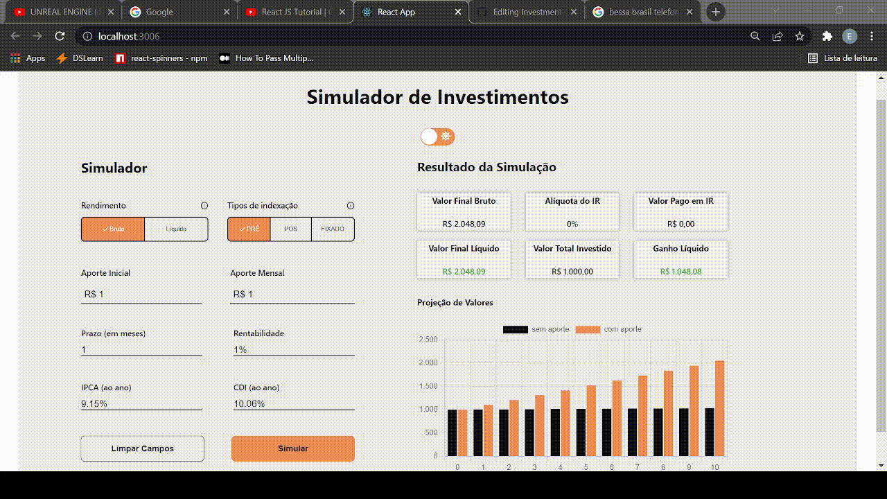
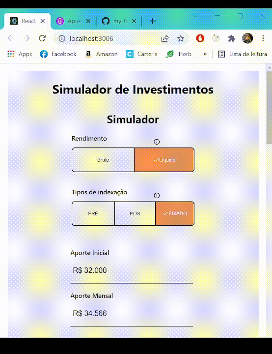

# Invest Now

## "The best way to simulate your investments."   

#### This application was built in React.js, reposivity, and with a nice chart, it simulates a common bank application in the real world.

# The App

# Responsivity

### Web

### Tablet

### Mobile

### Technologies

##### - React
##### - Styled-Components
##### - Chart.js

# Run the Fronted

### Install dependencies
    
    $ yarn install

### Run the project

    $ yarn start
    

# Run the Backend

#### Change to the desafio-api-fake folder:

### Run the project

    $ json-server --watch db.json
